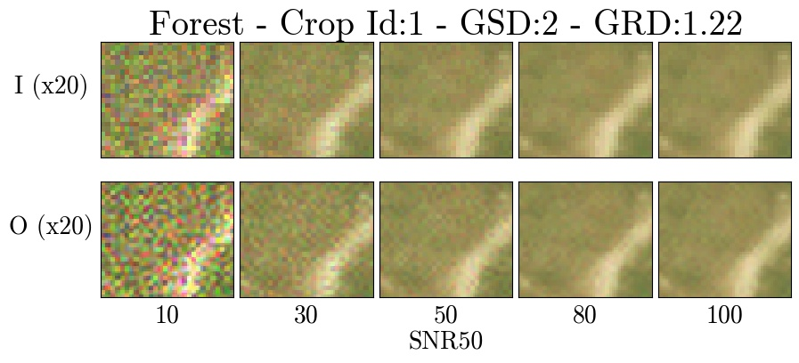
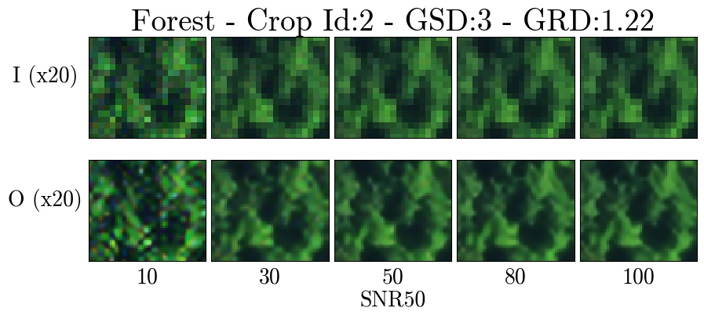
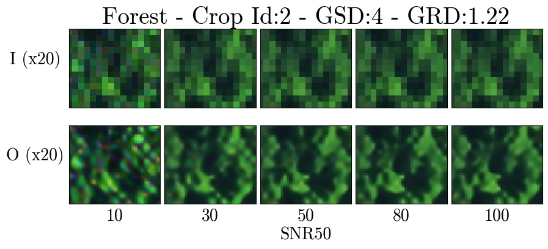
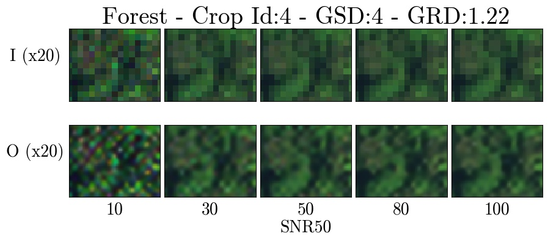
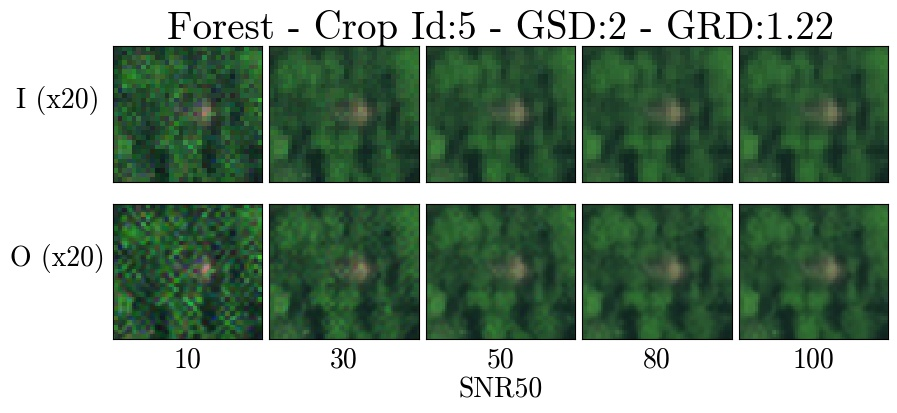
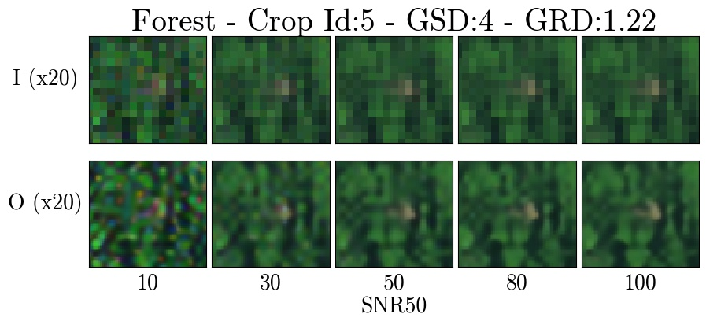

# Forest

Zoomed crops for the Forest terrain type.

Each figure shows 20x zoomed crops of degraded images (I) across the SNR tradespace (top row) and the associated super-resolution pipeline output (O) (bottom row). Each figure shows a particular GSD degradation factor (x2, x3, or x4).

## Crop 1

## Crop 2

## Crop 3

## Crop 4

## Crop 5

