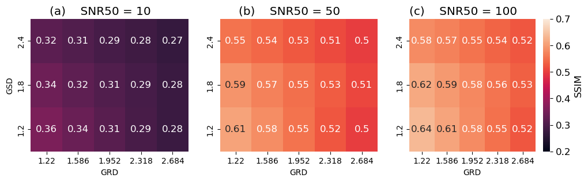
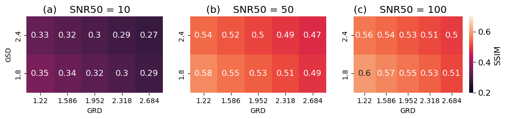

This webpage contains Supplementary material for the manuscript: <a href="https://arxiv.org/abs/2103.06270"> *Quantifying trade-offs in satellite hardware configurations via a super-resolution framework with realistic image degradation* </a>.

# Satellite images

Satellite images in the different pages below show the variability of super-resolved image reconstructions, given different satellite hardware configurations.

For each terrain type, the following pages show zoomed images that highlight the variability of super-resolution image reconstruction quality under several different degradation values:

[Beach](beach.md)

[Forest](forest.md)

[Rural](rural.md)

[Rural with Urban](rural_w_urban.md)

[Urban](urban.md)

# Supplementary figures

The below supplementary figures show SSIM values for different SNR50, GSD, and GRD values, averaged across all geographical types and crops, comparing the <a href="https://github.com/sanghyun-son/EDSR-PyTorch">EDSR model trained on DIV2K data</a> (Figure S1) and the <a href="https://github.com/Shaosifan/TransENet/">TransENet model trained on remote sensing data</a> (Figure S2).

Note that the two scaling factors we implemented consistently across both models are x3 (GSD=1.8) and x4 (GSD=2.4), and in those rows the associated SSIM values are almost identical for both models. This suggests that there is little difference between each model's ability to super-resolve the satellite imagery used in our study.

## Fig S1: EDSR results

***Figure S1:*** *SSIM values for different SNR50, GSD, and GRD values, for the EDSR model (trained on DIV2K data).*

## Fig S2: TransENet results

***Figure S2:*** *SSIM values for different SNR50, GSD, and GRD values, for the TransENet model (trained on remote sensing data).*
