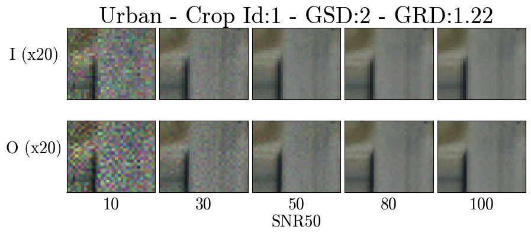
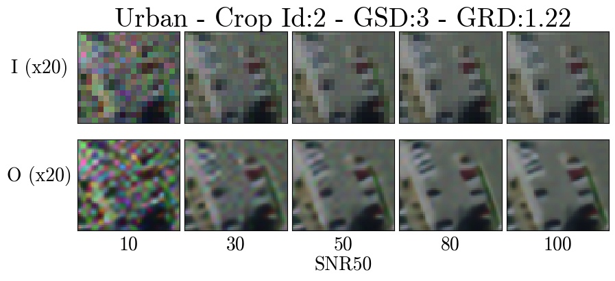
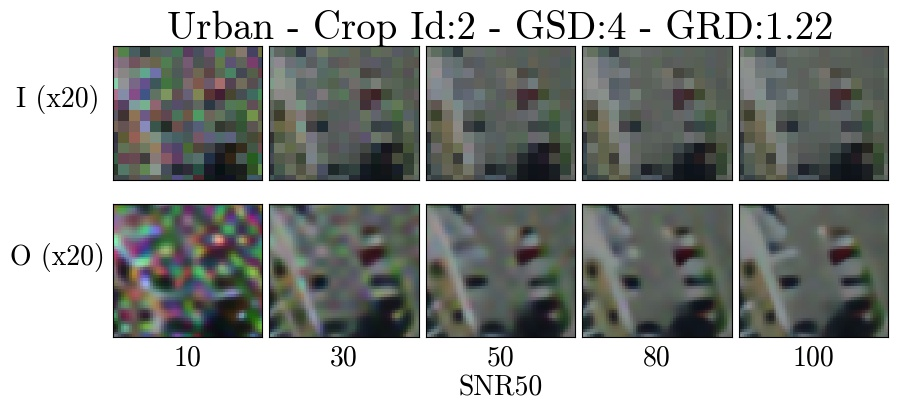
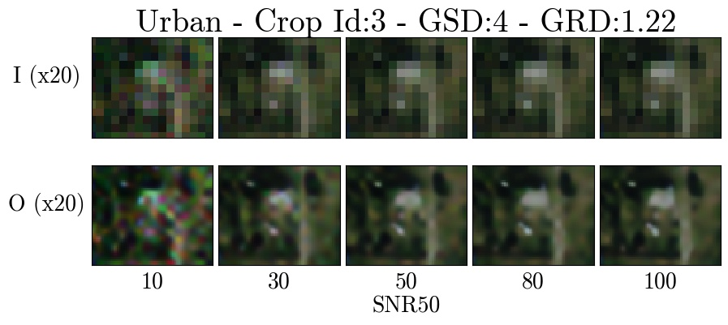
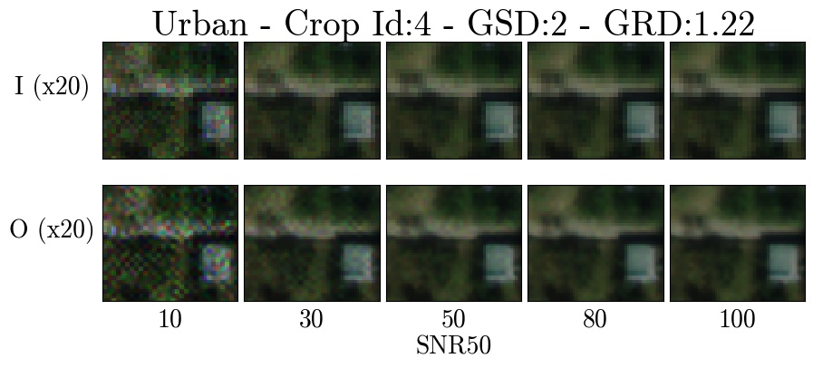
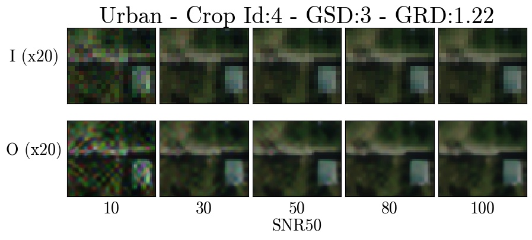
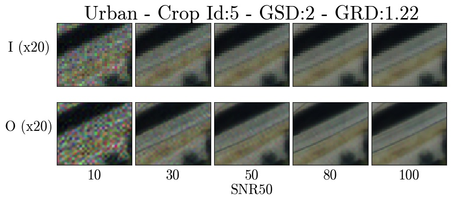
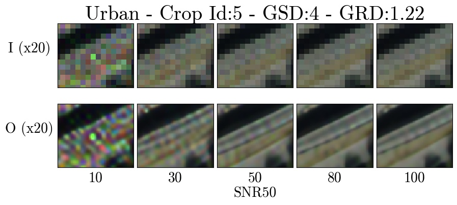

# Urban

Zoomed crops for the Urban terrain type.

Each figure shows 20x zoomed crops of degraded images (I) across the SNR tradespace (top row) and the associated super-resolution pipeline output (O) (bottom row). Different GSD degradation factors are shown for each crop (x2, x3, and x4).

## Crop 1

## Crop 2

## Crop 3

## Crop 4

## Crop 5

